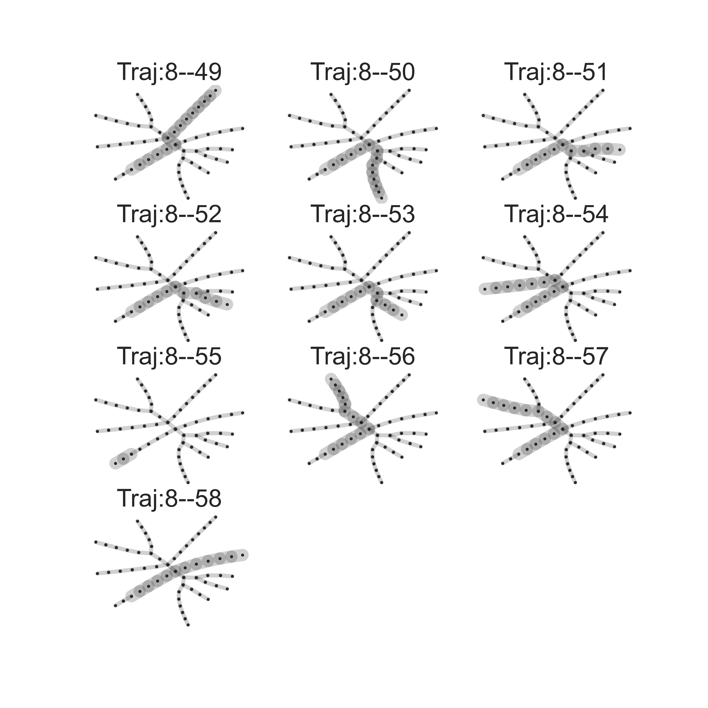
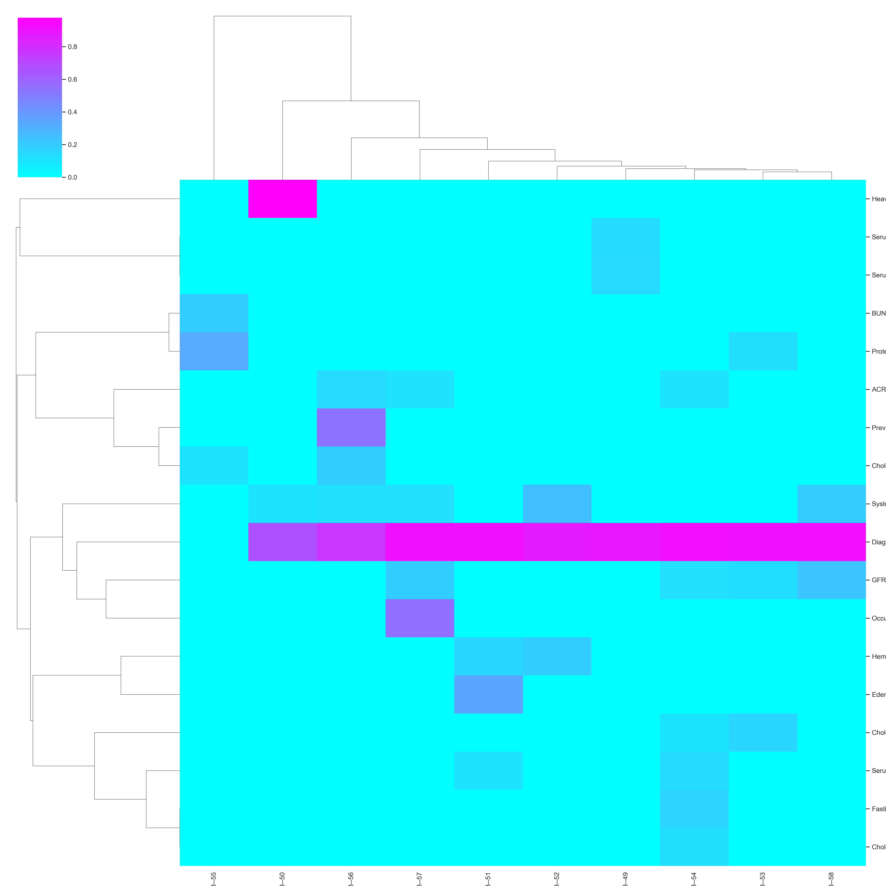

# Chronic Kidney Disease (CKD) Dataset Analysis

This repository contains an analysis of the **Chronic Kidney Disease (CKD)** dataset using **Elastic Principal Graphs** with the **ClinTrajan** package.

## Dataset

The CKD dataset used in this analysis is publicly available on Kaggle:

- [Chronic Kidney Disease Dataset](https://www.kaggle.com/datasets/rabieelkharoua/chronic-kidney-disease-dataset-analysis/)

Please download the dataset from the Kaggle link above and place it in the appropriate directory.

## Analysis Overview

I use **Elastic Principal Graphs** to analyze the CKD dataset and focus on creating and interpreting **pseudotime trajectories** . The main aim of the analysis is to explore disease progression insights using these methods.
I provide a **Jupyter notebook** [CKD-A](./CKD-A.ipynb)( that includes all the necessary code for data analysis, including pseudotime trajectory generation, variable associations, and hazard modeling. The notebook is structured to guide you through each step of the analysis process, from data preprocessing to visualization of the results.

You can download and run the notebook to replicate the analysis or adapt it to your own data.
## Tools and Libraries

The analysis is performed using the **ClinTrajan** package. You can find more information about ClinTrajan at the following link:

- [ClinTrajan GitHub Repository](https://github.com/auranic/ClinTrajan)

## Results 
1. **Principal Tree Example with Different Variables**: 
   
   The figure below displays the principal tree structure, where different branches represent various patient subgroups. Each plot illustrates how a specific clinical variable (e.g., serum creatinine, GFR, sodium levels) varies across the branches, highlighting differences in CKD progression within the dataset.

2. **Visualize Associations Between Variables and Tree Branches**:

   The heatmap visualizes the associations between clinical variables and the branches of the principal tree. The intensity of the color indicates the strength of the relationship, where pink highlights a strong association, and cyan represents a weaker one. This visualization helps identify which clinical variables are most influential in defining the patient subgroups along the tree structure.

3. **Visualize All Trajectories**:

   The image below presents a series of trajectories from the root node (0) to various other nodes in the principal tree. These trajectories highlight the progression paths through different branches, allowing us to track changes in clinical variables across different CKD patient subgroups. Each trajectory provides insight into how the disease progresses for distinct clusters of patients.

4. **Associate Trajectories with Variables by Regression**:

   The graph below illustrates the association between **Heavy Metals Exposure** and **Pseudotime** for Trajectory 0--61. The red dots represent the actual data points for heavy metals exposure along the pseudotime progression. The green line shows the probability curve based on the data, while the blue line represents a smoothed trend using a sliding average. 

5. **Draw Pseudotime Dependencies of Variables Significantly Associated with Trajectories**:

   The following graph shows the pseudotime dependencies of four clinical variables — **Protein in Urine**, **Serum Electrolytes/Phosphorus**, **Hemoglobin Levels**, and **Cholesterol/LDL** — along Trajectory 0--52. Each line represents the trend of a variable across pseudotime, helping to visualize how these markers change as the disease progresses. 

6. **Visualize Associations Between Variables and Trajectories**:

   The heatmap below illustrates the associations between various clinical variables and different trajectories in the dataset. The color intensity indicates the strength of the association, with brighter colors (e.g., pink) showing stronger correlations. This visualization helps in identifying key variables that are significantly related to specific trajectories, providing insights into which factors may influence disease progression at different stages.

7. **Hazard Graph**:

   The hazard graph below shows the progression of **Chronic Kidney Disease (CKD)** along different pseudotime trajectories. Each trajectory is represented by a different color, and the y-axis reflects the hazard value.

